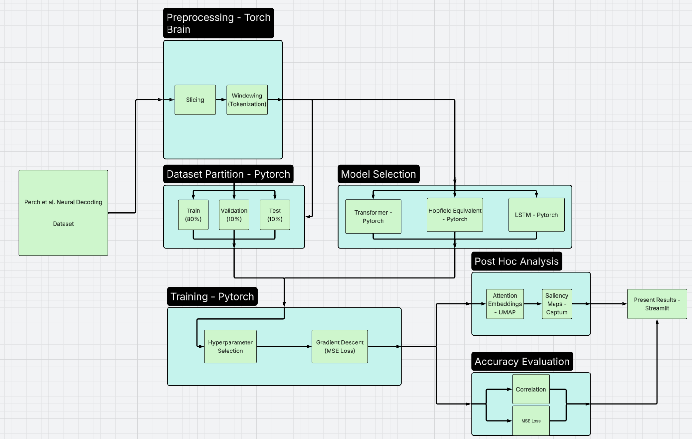

# Description of Code

In this markdown file, we will lay out what are the basic components that make up the git repository. There are two main levels we will discuss in our code base.

Some notes is that initially much of this code is writtein in Jupyter notebooks. These notebooks can be found in the additional_scripts/full_pipeline directory. However, we have reorganized the code in the src directory of the neural_comp_project git repo. The hope is that the organization of the scripts match exactly what we discuss in the design document.

For the next two sections, we will go over the partitions of the directory (*high level*) as well as the code itself (*Source code*)

## High Level Directory Description

At a high level, we follow the document design pipeline to partition our code. This is shown in the Figure Below (If not seeing this in our git repo, please see the results/misc directory).

There are five different directories which we will briefly go over:

1. **dataset**

- This is the code used to Load the dataset as well as contains helper functions for augmentations and tokenization of the temporal data.

2. **models**

- This directory contains the scripts with the model architectures. Currently we have five different scripts, but only use the hopfield_only.py, trainsformer.py, and transformer_hopfield.py scripts for this project.

3. **training**

- This directory contains the main training script for training all three of the models we attempt to anlayze.

4. **evaluation**

- The evaluation directory contains all graphing and metric functions we call to evaluate oru models.

5. **post_hoc_analysis**

- This directory contains methods of collecting/producing lower dimensions embeddings from these models as well as producing saliency maps.

## The Source Code

For each source file, we will go over the main scripts in each of these cases.
